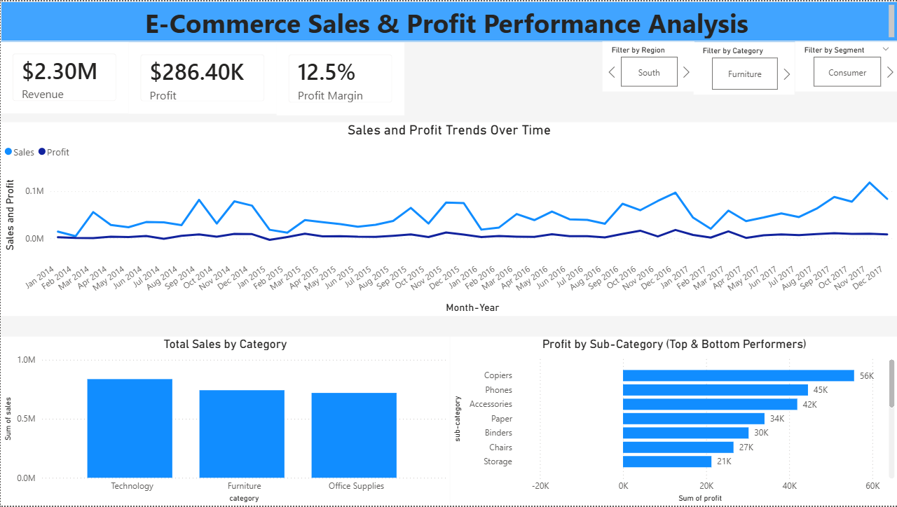

# Retail Profitability & Discount Impact Analysis
### SQL | Power BI | Excel

---

## The Dashboard

Built in Power BI with drill-through filters so you can move from 
overall performance → category → sub-category → region in a few clicks.

---

## The Problem I Was Trying to Solve

Most people look at $2.3M in revenue and think the business is doing well.

I wanted to find out why, despite that revenue, the profit margin was sitting at just 12.5%.
Something was quietly eating into the numbers — and I wanted to find exactly what.

---

## What I Used

- **MySQL** — querying 9,994 transactions, calculating KPIs, analyzing discount tiers
- **Power BI** — building an interactive dashboard with drill-through filters
- **Excel** — initial data cleaning and validation

Dataset: Sample Superstore Dataset (Kaggle) — 9,994 retail transactions across 
categories, regions, and customer segments.

---

## How I Approached It

- Loaded 9,994 transactions into MySQL and validated row counts and
  totals against the source file
- Calculated margin as profit ÷ revenue at every level rather than
  reading profit alone
- Used a CTE to bucket transactions into discount tiers, which is where
  the threshold became visible — the raw discount column has too many
  distinct values to read a pattern from
- Used a subquery to isolate sub-categories performing below the
  company-wide average margin
- Segmented the loss-making sub-categories by region to test whether
  losses were structural or local

---
## What I Found

**1. High revenue was masking a profitability problem**
$2.3M in revenue sounds strong. Only $286K in profit remained — a 12.5% margin that signals something is structurally off.

**2. Furniture sold like a major category and earned like a rounding error**
Furniture brought in $742,000 — 32% of all revenue, nearly matching
Technology's $836,000. But it returned just $18,451 in profit against
Technology's $145,456. That's a 2.49% margin versus 17.40%, seven times
worse, and it means a third of the revenue produced 6% of the profit.

**3. Tables and Bookcases lose money in three of four regions**
Both sub-categories run negative almost everywhere. Tables lost $17,726
overall, with the East region at -28.17% margin — the single worst
result in the dataset. Bookcases lost $3,473, negative in Central, West
and East. Each turns a profit in exactly one region (Bookcases in South
at 12.29%, Tables in West at 1.75%), which makes this a product problem
rather than a regional one. Together they destroyed $21,198 in profit.

**4. Discounts above 20% destroy profitability — without exception**

Margin falls at every tier as discounting increases:

| Discount | Orders | Revenue | Profit | Margin |
|----------|--------|---------|--------|--------|
| 0%       | 4,798  | $1,087,908 | $320,988 | 29.51% |
| 1–10%    | 94     | $54,369    | $9,029   | 16.61% |
| 11–20%   | 3,709  | $792,153   | $91,757  | 11.58% |
| 21–30%   | 227    | $103,227   | -$10,369 | -10.05% |
| 30%+     | 1,166  | $259,544   | -$125,007 | -48.16% |

20% is the breakeven line. Past it, every tier loses money.

The 30%+ tier is the real damage: 1,166 orders — under 12% of all
transactions — burned $125,007. Combined, discounts above 20%
destroyed $135,376 of profit. Without them, total profit would have
been $421,774 instead of $286,398. Roughly a third of this
business's potential profit was given away at the till.

**5. Peak season scales volume, not profitability**
Q4 (Oct–Dec) generated $878,078 — 38% of four-year revenue — at a
12.60% margin, statistically identical to the 12.47% annual average.
November 2017 was the single largest revenue month in the dataset at
$118,448, and returned an 8.18% margin, well below average. The
business gets bigger in Q4 without getting better: the same structural
margin problem simply operates at higher volume.

**6. Monthly margin is wildly unstable**
Margin swings from -18.05% (Jan 2015) to +27.21% (Oct 2016), with two
months outright negative across the four years. Monthly profit is
close to unpredictable even when revenue is steady — a sign that
discounting decisions, not demand, are driving the bottom line.

---

## What I Recommended

1. **Cap discounts at 20%** — requiring approval above that line. This
   alone protects $135,376, roughly a third of potential profit.
2. **Audit the 30%+ discount orders** — 1,166 transactions losing
   $125,007. Find out whether these are clearance, sales-rep
   discretion, or standing policy, because the fix differs in each case.
3. **Review Tables and Bookcases pricing or supplier costs** — a
   combined $21,198 loss, negative in three of four regions. Product
   economics, not regional execution.
4. **Report margin alongside revenue on every dashboard.** Furniture at
   32% of revenue and 6% of profit is invisible on a revenue-only report.
   
---

## What This Project Taught Me

Revenue is vanity, profit is sanity — but you need the data to prove it.

This project changed how I think about business metrics. Strong top-line 
numbers can hide serious operational problems. The job of analysis isn't 
just to report what happened — it's to find what the surface numbers 
aren't telling you.

---

## Files in This Repository

| File | Description |
|------|-------------|
| [analysis_queries.sql](SQL/analysis_queries.sql) | All SQL queries used in the analysis |
| [database_setup.sql](SQL/database_setup.sql) | Database and table setup queries |
| [ecommerce_sales_dashboard.pbix](Dashboard/ecommerce_sales_dashboard.pbix) | Power BI dashboard file |
| [Sample - Superstore.csv](Data/Raw/Sample%20-%20Superstore.csv) | Raw dataset used |
| [Images/](Images/) | Dashboard screenshots |
